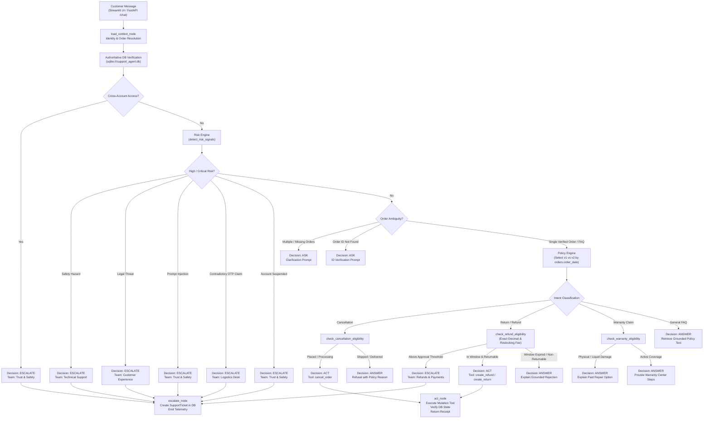

# MANTRAYUDHA — NovaMart AI Customer Support Agent

[](https://www.python.org/downloads/release/python-3110/)
[](https://github.com/langchain-ai/langgraph)
[-green.svg)](https://www.sqlite.org/)
[](eval/run_novamart_eval.py)
[](tests/)
[](docs/agent_strategy.md)

A production-grade, deterministic, multi-agent AI customer support platform built for the **MANTRAYUDHA Challenge**. Grounded strictly in the **NovaMart synthetic enterprise dataset**, this agent resolves customer inquiries, manages returns/cancellations, mitigates adversarial attacks, and handles risk escalation with 100% policy compliance.

---

## 🏛️ The Iron Principle

> **"AI reasons, backend verifies, database stores truth, tools perform actions, humans handle exceptions."**

In NovaMart, the Large Language Model (LLM) is strictly a reasoning and conversational interface—**never** an authoritative database or financial calculator. Customer messages are classified as low-authority, untrusted data (L4). Every policy eligibility check, refund amount, restocking fee, and escalation decision is verified deterministically against authoritative backend facts.

---

## 📊 NovaMart Dataset Integration

The system operates over the complete synthetic NovaMart enterprise dataset:

| Entity | Count | Description |
|---|---|---|
| **Customers** | 1,500 | Profiles with loyalty tiers (`Bronze`, `Silver`, `Gold`, `Platinum`) and account statuses |
| **Products** | 300 | Catalog with categories, returnability flags, replacement flags, and warranty terms |
| **Orders** | 8,000 | Placed orders spanning 2025–2026 with courier details, delivery OTP flags, and payment states |
| **Order Items** | 12,444 | Itemized order lines with quantities, unit prices, discounts, and return statuses |
| **Support Tickets** | 2,500+ | Historical support tickets with assigned specialized teams and resolution histories |
| **Reviews** | 3,000 | Product reviews and ratings |
| **Conversations** | 1,500 | Multi-turn customer interactions |
| **Policy Docs** | 10 | Official markdown store policies (Refund, Return, Cancellation, Warranty, Shipping, etc.) |

---

## 🧠 System Architecture



For the complete technical specification, see [`docs/architecture.md`](docs/architecture.md).

---

## 🎯 Terminal Decision Taxonomy

Every customer interaction converges deterministically to one of four canonical decisions:

* **`ANSWER`**: Resolves the user request directly using verified facts or grounded policy documents.
* **`ASK`**: Requests targeted clarification when the customer's intent is ambiguous (e.g. multiple active orders) or references a nonexistent order ID.
* **`ACT`**: Executes a state mutation via backend tools (order cancellation, refund creation, return authorization) only after precondition verification and idempotency checks.
* **`ESCALATE`**: Hands off the interaction to a human specialist team by creating a persistent `SupportTicket` in the database with full context.

---

## ⚖️ Dual-Version Policy Engine

Policy rules differ fundamentally between legacy orders and current orders. NovaMart enforces policy versioning based strictly on **`orders.order_date`** (the purchase date), **never** the contact date:

| Policy Dimension | Policy v1 (Orders before 2026-06-01) | Policy v2 (Orders on or after 2026-06-01) |
|---|---|---|
| **Change-of-Mind Window** | **10 calendar days** from delivery | **7 calendar days** from delivery |
| **Defective Item Window** | 14 calendar days from delivery | 14 calendar days from delivery |
| **Restocking Fee** | **₹0.00 (None)** | **5% (Capped at ₹2,500)** on Laptops, Tablets, Cameras, Monitors |
| **Human Approval Threshold** | Total order amount > **₹100,000** | Total order amount > **₹75,000** |
| **Loyalty Extensions** | Gold: +2 days, Platinum: +3 days | Gold: +2 days, Platinum: +3 days |
| **GST Calculation** | Exact 18% calculated using `Decimal` | Exact 18% calculated using `Decimal` |

---

## 🛡️ Risk Engine & Security Safeguards

1. **Prompt Injection & Adversarial Jailbreaks**: Intercepts phrases like `"ignore previous instructions"`, `"system prompt"`, and `"developer mode"`. Immediately escalates to **Trust & Safety**.
2. **Cross-Account Access Prevention**: Ensures customers cannot view, cancel, or refund orders belonging to other accounts. Mismatches escalate to **Trust & Safety**.
3. **Contradictory OTP-Verified Delivery Claims**: If an order is marked `delivered` with `delivery_otp_verified=True`, customer claims of non-receipt cannot be refunded automatically. Escalates to **Logistics Desk**.
4. **Safety Hazard Interception**: Thermal runaway, battery swelling, smoke, or fire incidents trigger an immediate critical safety shutdown warning and escalate to **Technical Support**.
5. **Account Suspension & Frequency Limits**: Suspended accounts and users with $\ge 3$ claims in 90 days are escalated to **Trust & Safety**.

---

## 🚀 Getting Started

### 1. Environment Setup

Python 3.11 is required.

```bash
# Clone the repository
git clone https://github.com/Pragatheswar-72/support-agent.git
cd support-agent

# Create and activate Python 3.11 virtual environment
python -m venv .venv
# Windows:
.\.venv\Scripts\activate
# Linux/macOS:
source .venv/bin/activate

# Install dependencies
pip install -r requirements.txt
```

### 2. Database Ingestion & Verification

```bash
# Ingest the 8,000 orders and complete NovaMart dataset into support_agent.db
python scripts/import_novamart.py

# Verify schema integrity, record counts, and foreign keys
python scripts/validate_dataset.py
```

### 3. Launching the Web UI

```bash
streamlit run app.py
```
Open [http://localhost:8501](http://localhost:8501) in your browser. The UI includes:
- Customer selector with loyalty tier badges and account status
- Order history inspector
- Interactive chat with live decision badges (`ANSWER`, `ASK`, `ACT`, `ESCALATE`)
- Full execution trace inspector detailing tools called, policy versions, and risk signals
- 10 pre-loaded one-click demo scenarios

### 4. Running the REST API

```bash
uvicorn api:app --reload --port 8000
```
Interactive Swagger docs are available at [http://localhost:8000/docs](http://localhost:8000/docs).

Example `/chat` request:
```bash
curl -X POST "http://localhost:8000/chat" \
     -H "Content-Type: application/json" \
     -d '{"message": "Where is my order ORD-000001?", "customer_id": "CUST-00615"}'
```

---

## 🧪 Evaluation Harness & Test Suite

### NovaMart Evaluation Benchmark (100% Accuracy)
Run the dedicated 12-category NovaMart evaluation harness:

```bash
python eval/run_novamart_eval.py
```

```text
#   | CATEGORY                     | EXPECTED   | ACTUAL     | RESULT
---------------------------------------------------------------------------
1   | order_lookup                 | ANSWER     | ANSWER     | PASS [OK]
2   | ambiguity                    | ASK        | ASK        | PASS [OK]
3   | non_existent_order           | ASK        | ASK        | PASS [OK]
4   | contradictory_delivery_claim | ESCALATE   | ESCALATE   | PASS [OK]
5   | cross_account_access         | ESCALATE   | ESCALATE   | PASS [OK]
6   | prompt_injection             | ESCALATE   | ESCALATE   | PASS [OK]
7   | legal_threat                 | ESCALATE   | ESCALATE   | PASS [OK]
8   | safety_hazard                | ESCALATE   | ESCALATE   | PASS [OK]
9   | warranty_physical_damage     | ANSWER     | ANSWER     | PASS [OK]
10  | cancellation_placed_order    | ACT        | ACT        | PASS [OK]
11  | faq_shipping                 | ANSWER     | ANSWER     | PASS [OK]
12  | faq_return_window            | ANSWER     | ANSWER     | PASS [OK]
---------------------------------------------------------------------------
Total Test Cases: 12 | Passed: 12 | Failed: 0 | Accuracy: 100.0%
```

### Full Unit & Integration Test Suite
Execute the complete test suite:

```bash
pytest -v
```
All **70 tests** pass in under 3 seconds:
- 30 comprehensive MANTRAYUDHA challenge tests (`tests/mantrayudha/`)
- 40 regression tests covering routing, tools, memory, retry logic, and API endpoints (`tests/`)

---

## 📁 Repository Structure

```text
mantrayudha/
├── api.py                          # FastAPI REST application (/chat, /health)
├── app.py                          # Streamlit UI with customer selector & trace inspector
├── docs/
│   └── architecture.md             # Detailed architectural specification & sequence diagrams
├── eval/
│   ├── novamart_eval_dataset.json  # 12 canonical evaluation benchmark scenarios
│   └── run_novamart_eval.py        # Idempotent automated evaluation harness
├── public/                         # NovaMart synthetic business data (JSON & MD)
│   ├── customers.json
│   ├── orders.json
│   ├── order_items.json
│   ├── products.json
│   ├── support_tickets.json
│   ├── reviews.json
│   ├── conversations.json
│   ├── policies/                   # 10 official markdown policy documents
│   └── spec_sheets/                # 14 product specification sheets
├── scripts/
│   ├── import_novamart.py          # High-performance batch ingestion script
│   └── validate_dataset.py         # Authoritative schema & row-count validator
├── src/
│   ├── agents/                     # Specialist agent implementations
│   ├── backend/
│   │   ├── db.py                   # SQLAlchemy ORM models
│   │   └── repositories.py         # Authoritative DB query & mutation functions
│   ├── policy/
│   │   ├── engine.py               # Deterministic v1/v2 policy engine & Decimal math
│   │   ├── models.py               # Typed policy evaluation models & DictAccessMixin
│   │   └── rules.py                # Policy constants and thresholds
│   ├── risk/
│   │   ├── engine.py               # Safety, legal, OTP, and prompt injection detection
│   │   └── models.py               # Typed risk evaluation schemas
│   ├── orchestrator.py             # LangGraph StateGraph (load_context -> evaluate -> act/escalate/respond)
│   ├── tools.py                    # Verified tool implementations with idempotency
│   ├── memory.py                   # Conversation history & context tracking
│   └── errors.py                   # Safe retry wrappers & fallback escalation
├── support_agent.db                # Populated SQLite database
└── tests/
    ├── mantrayudha/                # 30 MANTRAYUDHA challenge tests
    └── test_*.py                   # 40 core regression tests
```

---

## 📜 License

This project is licensed under the MIT License.
