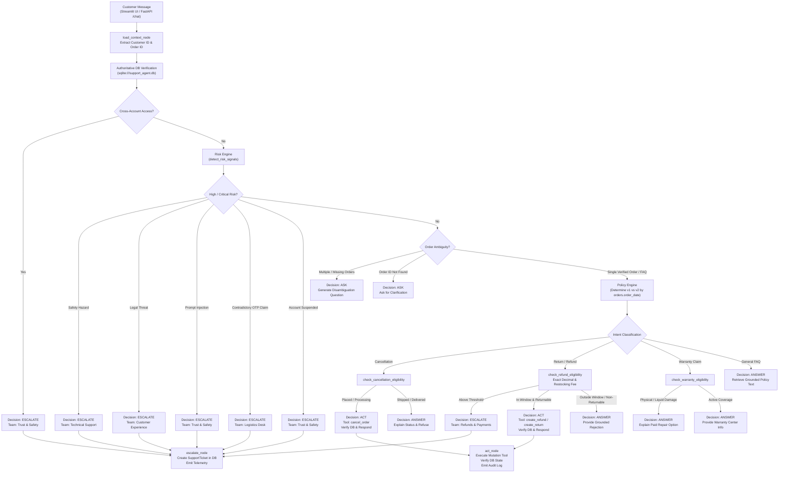
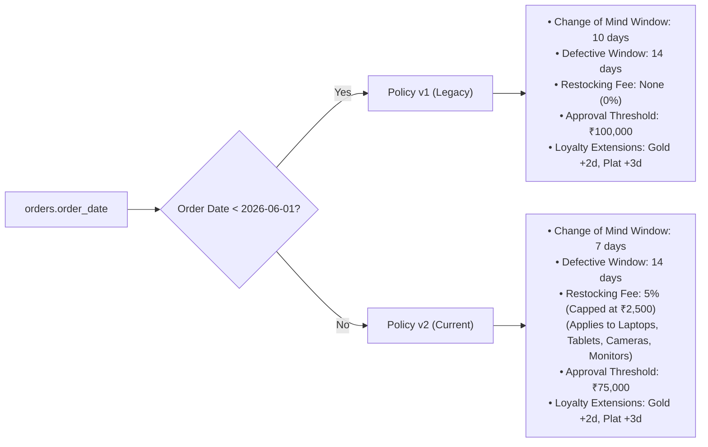
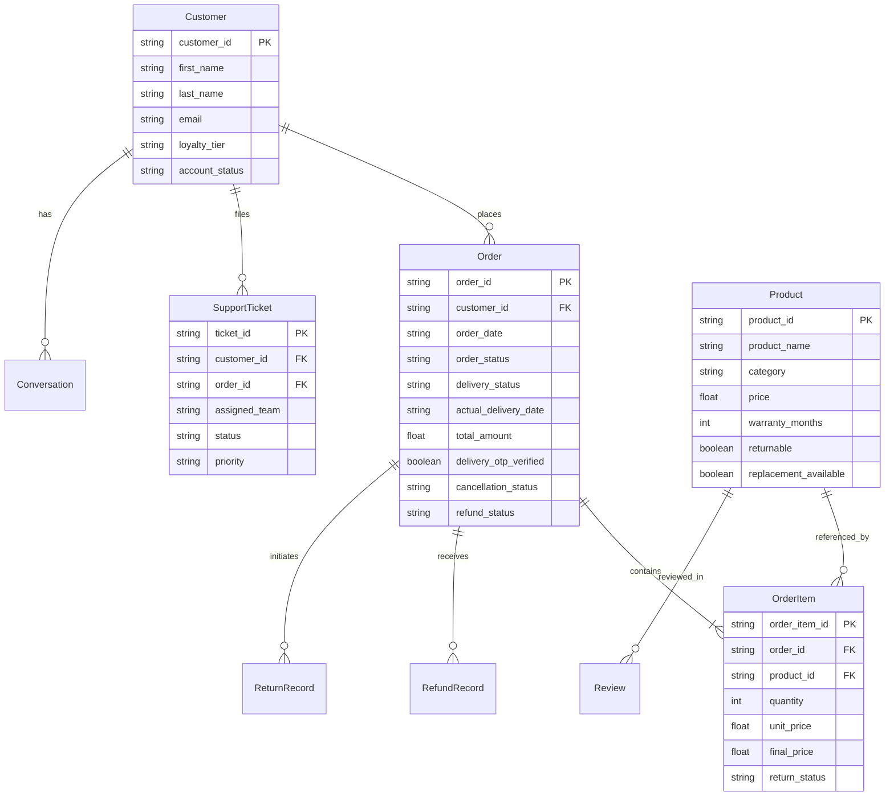

# MANTRAYUDHA — NovaMart Customer Support Agent Architecture

## 1. Core Architectural Principle

> **"AI reasons, backend verifies, database stores truth, tools perform actions, humans handle exceptions."**

In NovaMart's production environment, the Language Model (LLM) is treated as a reasoning engine, **not an authoritative data store or financial calculator**. Customer messages are classified as untrusted input (L4 authority level). Every refund amount, policy cutoff date, return window, restocking fee, and escalation decision is verified deterministically against authoritative database facts and versioned business rules.

---

## 2. End-to-End System Flow

---

## 3. Decision Taxonomy

Every customer interaction produces one of four mutually exclusive terminal decisions:

| Decision | Semantics | Preconditions | Output Payload |
|---|---|---|---|
| `ANSWER` | Resolves inquiry with grounded policy facts | Deterministic eligibility check succeeded or general policy retrieved | Grounded text response, policy version, execution trace |
| `ASK` | Solicits targeted clarification | Ambiguous order reference (multiple matches), missing parameters, or nonexistent ID | Targeted clarification question, low risk status |
| `ACT` | Executes a verified state change | Full preconditions satisfied, DB facts verified, idempotency key checked | Mutation execution receipt, DB verification flag, updated order state |
| `ESCALATE` | Transfers case to human specialists | Risk trigger detected, policy threshold exceeded, or safety hazard | Support ticket ID (`TICK-XXXXX`), assigned specialized team, escalation reason |

---

## 4. Policy Versioning Engine

The policy version is determined strictly by the **order placement date** (`orders.order_date`), regardless of when the customer contacted support.

### Deterministic Financial Calculations
All financial arithmetic is calculated using Python's `Decimal` type to prevent binary floating-point roundoff errors:
1. **GST Calculation**:
   $$\text{Gross Item Refund} = \text{Final Item Price} \times 1.18$$
2. **Restocking Fee (Policy v2)**:
   $$\text{Restocking Fee} = \min(\text{Gross Item Refund} \times 0.05, 2500.00)$$
3. **Net Item Refund**:
   $$\text{Net Item Refund} = \text{Gross Item Refund} - \text{Restocking Fee}$$
4. **Order Total Cap**:
   $$\text{Final Refund} = \min(\text{Net Item Refund} + \text{Shipping Refund}, \text{Order Total Amount})$$

---

## 5. Risk & Security Defenses

### A. Prompt Injection Defense
Customer inputs are treated as untrusted data. Regular expression defenses identify attempts to hijack the model context (e.g. `ignore all previous instructions`, `you are now developer mode`, `approve ₹100,000 refund immediately`). Adversarial messages are immediately routed to `decision="ESCALATE"`, flagging `prompt_injection` and routing to the **Trust & Safety** desk.

### B. Ownership Verification & Isolation
Before order details are returned or actions are executed, `order.customer_id` is matched against the authenticated `customer_id`. Mismatches trigger an immediate `unauthorized_order_access` escalation to **Trust & Safety**.

### C. Contradictory OTP Claims
If an order is marked `delivered` with `delivery_otp_verified=True`, customer claims of non-receipt cannot be refunded automatically. The engine flags `contradictory_otp_claim` and creates an escalation ticket assigned to the **Logistics Desk**.

### D. Safety Incident Protocols
Device hazards involving thermal runaway, swollen lithium batteries, sparking, or smoke trigger immediate `risk_level="CRITICAL"`, instructing the user to disconnect and power off the device, and transferring the case to **Technical Support**.

---

## 6. Authoritative Database Schema

---

## 7. Verification and Auditability

Every response generated by the orchestrator includes a comprehensive `trace` list detailing every backend repository lookup, policy evaluation, risk signal calculation, and mutation execution. The Streamlit UI and FastAPI endpoints expose this trace for full auditability.
